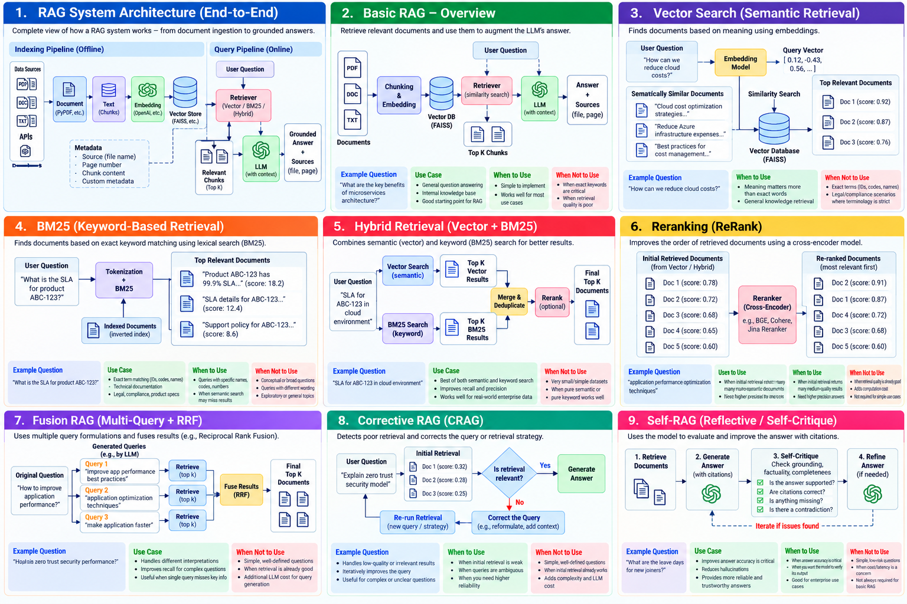
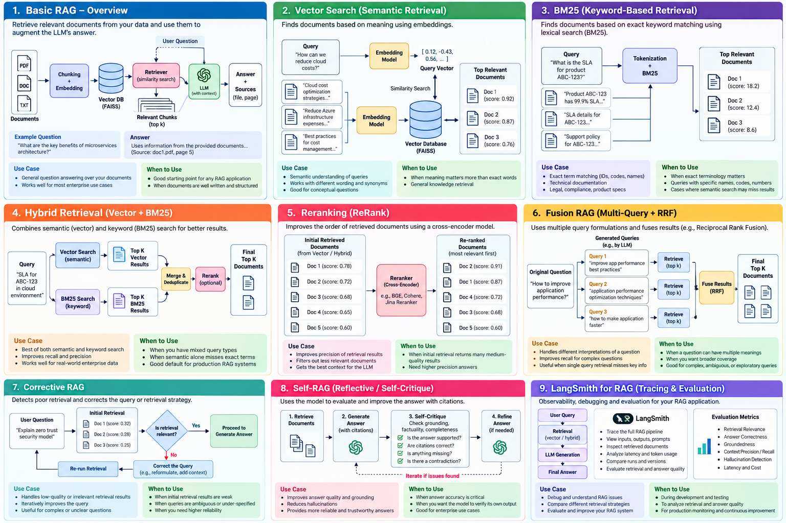

# RAG Knowledge Base

A structured RAG knowledge base and Multi-PDF RAG implementation using LangChain, Streamlit, FAISS, OpenAI embeddings, and a chat model.

The repository is intentionally organized around a **baseline-first engineering approach**:

> Understand → Build baseline → Test → Diagnose retrieval → Improve only when justified → Evaluate again

## Project Highlights

- Multi-PDF upload in a single Streamlit application
- One combined FAISS vector knowledge base
- Recursive text chunking with preserved file/page metadata
- OpenAI embeddings and grounded ChatOpenAI generation
- Indexed chunk count and chunk preview
- File + page source citations
- Streamlit session state and corpus-aware indexing
- Retrieval and LLM latency visibility
- Retrieval-focused experiments documenting both successful and failed cases

## Architecture


### Baseline flow

```text
Multiple PDFs
      ↓
PyPDFLoader
      ↓
File + page metadata
      ↓
Recursive chunking
      ↓
OpenAI embeddings
      ↓
FAISS
      ↓
Semantic retrieval
      ↓
Grounded prompt
      ↓
Chat model
      ↓
Answer + file/page sources
```

## Documentation Navigation

### Core RAG

1. [RAG Fundamentals](01_RAG_Fundamentals.md)
2. [RAG Architecture](02_RAG_Architecture.md)
3. [RAG Types](03_RAG_Types.md)

### Advanced Retrieval Strategies

4. [Hybrid Retrieval](04_Hybrid_Retrieval.md)
5. [BM25 and Reranking](05_BM25_and_Reranking.md)
6. [Fusion RAG](06_Fusion_RAG.md)
7. [Self-RAG and Corrective RAG](07_Self_RAG_and_Corrective_RAG.md)

### Evaluation and Project Findings

8. [LangSmith and RAG Evaluation](08_LangSmith_and_RAG_Evaluation.md)
9. [Project Implementation and Evaluation](09_Project_Implementation_and_Evaluation.md)

## Project Evidence

- `../images/rag_baseline_architecture.png` — implemented architecture
- `../images/rag_evaluation_workflow.png` — evaluation workflow
- `../images/cross_document_retrieval_observation.png` — cross-document retrieval observation
- `multipdf_rag_output.pdf` — Streamlit output captured from the working application
- `experiments/Naive_RAG_retrieval.py` — earlier baseline experiment retained for comparison

## Key Engineering Findings

### 1. Baseline RAG works

A question about content present in the uploaded corpus produced a grounded answer with file/page citations. The tested knowledge base contained 3 PDFs, 19 pages, and 68 indexed chunks.

### 2. A missing document is not a retrieval failure

The reward-penalty test initially appeared to be a retrieval problem. Investigation showed that the PDF containing that concept had not been uploaded. The system correctly refused to invent an answer.

### 3. Increasing top-k does not guarantee cross-document coverage

A compound question requiring evidence from both the Machine Learning PDF and FinVector-Market PDF was tested with `k=4` and then `k=8`. The retrieval remained dominated by FinVector evidence and missed the FastML evidence.

This demonstrates an important principle:

> **Retrieval quality must be evaluated independently of generation, and larger top-k does not automatically provide complete evidence coverage.**

The observation is documented rather than "fixed" by adding unnecessary advanced retrieval components.

## Design Principle

Advanced RAG techniques are **options, not mandatory components**.

Hybrid retrieval, BM25, reranking, Fusion, corrective logic, and self-reflection should be introduced only when evaluation shows a specific retrieval or grounding problem that justifies the additional complexity.

## Implementation

The application entry point is:

```text
rag_app.py
```

Run it with:

```text
streamlit run rag_app.py
```

Dependencies are listed in:

```text
requirements.txt
```

The OpenAI API key is read from an environment variable.

## Repository Structure

```text
rag-engine/
├── docs/
│   ├── experiments/
│   │   └── Naive_RAG_retrieval.py
│   ├── 01_RAG_Fundamentals.md
│   ├── 02_RAG_Architecture.md
│   ├── 03_RAG_Types.md
│   ├── 04_Hybrid_Retrieval.md
│   ├── 05_BM25_and_Reranking.md
│   ├── 06_Fusion_RAG.md
│   ├── 07_Self_RAG_and_Corrective_RAG.md
│   ├── 08_LangSmith_and_RAG_Evaluation.md
│   ├── 09_Project_Implementation_and_Evaluation.md
│   ├── multipdf_rag_output.pdf
│   └── README.md
├── images/
│   ├── rag_baseline_architecture.png
│   ├── rag_evaluation_workflow.png
│   └── cross_document_retrieval_observation.png
├── rag_app.py
├── requirements.txt
├── .env
└── .gitignore
```

> Keep secrets such as `.env` out of GitHub. Commit only the environment-variable template if one is needed.

## Architecture



## RAG Retrieval Techniques


