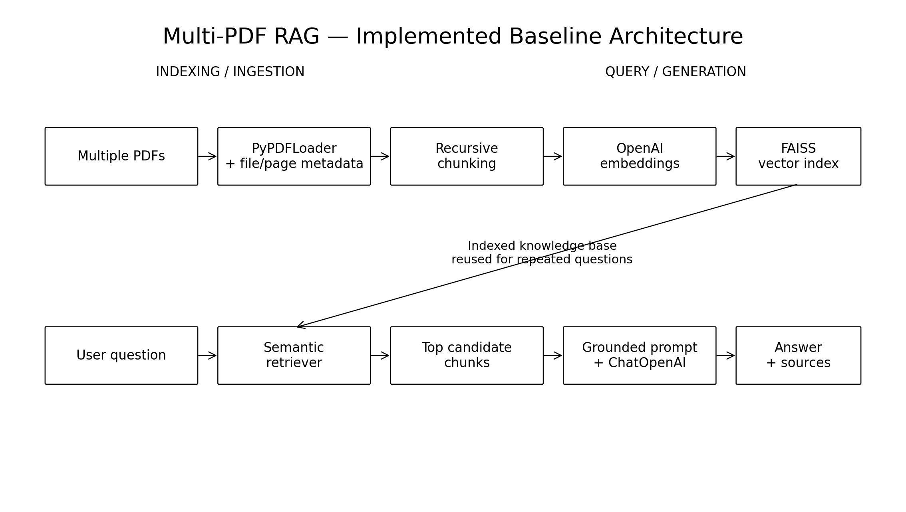

# 02 — RAG Architecture

## 1. End-to-End RAG Architecture

A production-oriented RAG system has two major paths:

```text
                OFFLINE / INDEXING
                ==================

Documents
   ↓
Document Loader
   ↓
Parsing
   ↓
Chunking
   ↓
Metadata enrichment
   ↓
Embeddings
   ↓
Vector Index
```

and:

```text
                 ONLINE / QUERY
                 ==============

User Question
      ↓
Query Processing
      ↓
Retriever
      ↓
Relevant Chunks
      ↓
Context Construction
      ↓
LLM
      ↓
Grounded Answer
      ↓
Sources / Citations
```

## 2. Why Separate Indexing and Querying?

Indexing is expensive and should normally happen when documents are added or changed.

Querying happens repeatedly.

```text
Index once
    ↓
Ask many questions
    ↓
Retrieve quickly
```

For the Streamlit assignment, uploaded documents can be indexed into a session-scoped FAISS store.

## 3. Document Object

A useful chunk contains two things:

```text
Document
├── page_content
└── metadata
     ├── source
     └── page
```

The content is used for retrieval and generation.

The metadata is used for traceability.

For the assignment, page and file metadata are especially important because every answer must show where the information came from.

## 4. Chunking

A document is usually too large to retrieve as one block.

Chunking creates smaller retrieval units:

```text
PDF
 │
 ├── Chunk 1
 ├── Chunk 2
 ├── Chunk 3
 ├── Chunk 4
 └── ...
```

### Chunk size trade-off

Too small:

- loses context;
- produces fragmented answers;
- increases the number of chunks.

Too large:

- includes irrelevant information;
- reduces retrieval precision;
- can cause several unrelated topics to arrive in the same context.

### Chunk overlap

Overlap helps preserve information that crosses chunk boundaries.

## 5. Metadata Preservation

For a Multi-PDF RAG system:

```text
chunk.metadata = {
    "source": "handbook.pdf",
    "page": 7
}
```

The application can then produce:

```text
Sources:
- handbook.pdf — page 7
```

This is not cosmetic. It allows users to verify the answer.

## 6. Retrieval

A retriever maps:

```text
Question → Relevant Chunks
```

The simplest approach is vector similarity search.

But retrieval can later evolve into:

```text
Vector Search
      +
BM25
      ↓
Hybrid Retrieval
      ↓
Reranking
```

## 7. Generation

The LLM receives:

```text
Question
+
Retrieved Context
+
Instructions
```

A grounded prompt should clearly tell the model to use the supplied context and avoid inventing unsupported facts.

## 8. Multi-Document Conflict

Multiple documents may contain inconsistent information:

```text
policy.pdf    → 12 days
handbook.pdf  → 15 days
faq.pdf       → 12 days
```

A trustworthy system should expose the conflict rather than hide it.

This is one of the most important design lessons in the Day 4 assignment.

## 9. Target Architecture

```text
             ┌─────────────────────┐
             │    Streamlit UI     │
             │ Upload + Questions  │
             └──────────┬──────────┘
                        │
                        ▼
             ┌─────────────────────┐
             │  Document Ingestion │
             └──────────┬──────────┘
                        │
                 PDF → chunks
                        │
                        ▼
             ┌─────────────────────┐
             │ OpenAI Embeddings   │
             └──────────┬──────────┘
                        │
                        ▼
             ┌─────────────────────┐
             │      FAISS          │
             └──────────┬──────────┘
                        │
                        ▼
             ┌─────────────────────┐
             │     Retriever       │
             └──────────┬──────────┘
                        │
                        ▼
             ┌─────────────────────┐
             │ Prompt + Chat Model │
             └──────────┬──────────┘
                        │
                        ▼
             ┌─────────────────────┐
             │ Answer + Sources    │
             └─────────────────────┘
```

LangSmith can observe the major stages across this pipeline.


---

## 10. Implemented Baseline Architecture

The working Streamlit application follows this concrete baseline:



```text
Multiple PDFs
      ↓
PyPDFLoader
      ↓
File + page metadata
      ↓
RecursiveCharacterTextSplitter
      ↓
OpenAI text-embedding-3-small
      ↓
FAISS
      ↓
Semantic Retriever
      ↓
Top Candidate Chunks
      ↓
Grounded Prompt
      ↓
ChatOpenAI
      ↓
Answer + File/Page Sources
```

The application also exposes indexed chunk counts, chunk previews, indexing timings, retrieval timings, and generation timings so that the retrieval and generation stages can be inspected independently.

## 11. Why the Baseline Was Kept Simple

The assignment requires a Multi-PDF RAG application, not an advanced retrieval framework. Therefore the first implementation deliberately uses one semantic retriever and one FAISS index.

Advanced techniques remain documented as possible future improvements. They are not added merely because they are available.

The engineering rule is:

```text
Baseline
   ↓
Measure
   ↓
Identify a real failure pattern
   ↓
Choose the smallest justified improvement
   ↓
Evaluate again
```
