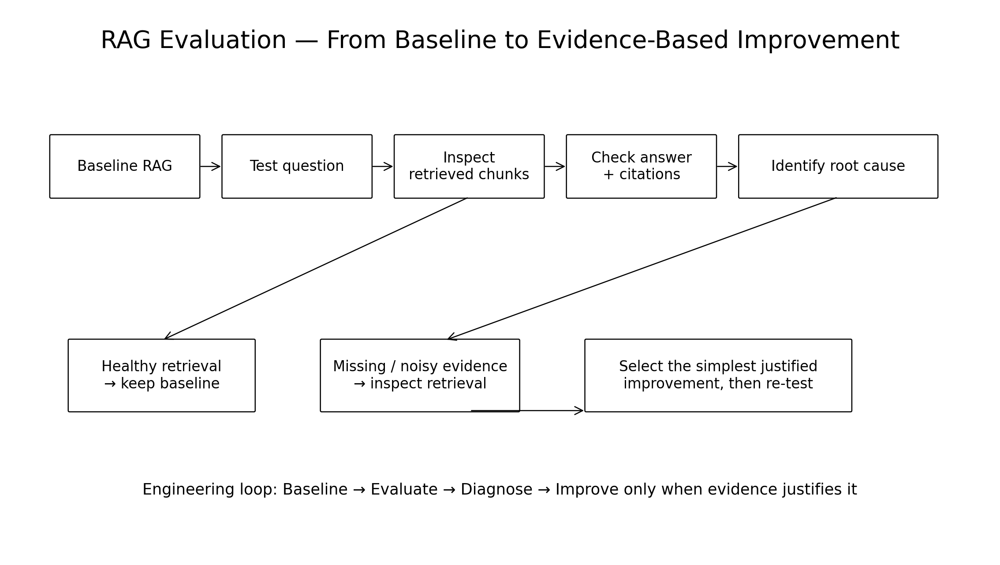
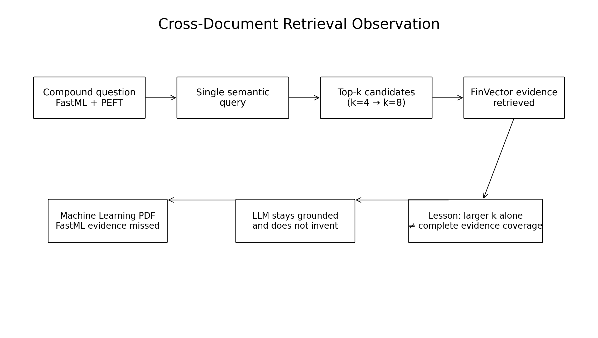

# 08 — LangSmith and RAG Evaluation

## 1. Why Observability Matters

A RAG answer can be wrong for many different reasons:

```text
Wrong answer
    │
    ├── Bad parsing
    ├── Bad chunking
    ├── Bad embeddings
    ├── Bad retrieval
    ├── Bad ranking
    ├── Bad prompt
    └── LLM generation problem
```

Without tracing, these failures can look identical to the user.

## 2. LangSmith

LangSmith can be used to observe and trace application execution.

A RAG trace can conceptually look like:

```text
User Question
     ↓
Retriever
     ↓
Retrieved Documents
     ↓
Prompt Construction
     ↓
Chat Model
     ↓
Final Answer
```

This helps identify where quality problems occur.

## 3. What to Inspect

For each query, useful information includes:

### Query

What did the user ask?

### Retrieved documents

Which chunks were selected?

### Metadata

Which file and page produced each chunk?

### Prompt

What context was actually given to the model?

### Response

What answer did the model produce?

### Latency

How long did retrieval and generation take?

## 4. RAG Evaluation

Evaluation should separate retrieval quality from answer quality.

### Retrieval questions

- Did we retrieve the correct chunk?
- Did we retrieve enough evidence?
- Did irrelevant chunks dominate the context?
- Did the source metadata identify the correct page?

### Generation questions

- Is the answer supported by the retrieved context?
- Did the model invent information?
- Did it correctly handle conflicting documents?
- Does the answer actually address the question?

## 5. Simple Evaluation Dataset

Create questions such as:

```text
Question 1 → answer found on page 7
Question 2 → answer requires two documents
Question 3 → documents disagree
Question 4 → exact technical term
Question 5 → answer not present in documents
```

This is much more valuable than testing only easy questions.

## 6. Important Test Case: No Answer

Ask:

> What is the company's policy for something that does not exist in the uploaded PDFs?

A trustworthy RAG application should not invent an answer.

Expected behavior:

```text
Evidence not found
       ↓
Say that the uploaded documents do not contain
sufficient information
```

## 7. Important Test Case: Conflicting Sources

If:

```text
policy.pdf   → 12 days
handbook.pdf → 15 days
```

the system should expose the conflict.

Possible response:

```text
The uploaded documents contain conflicting information.
policy.pdf states 12 days, while handbook.pdf states 15 days.
Please verify which document is the current authoritative policy.
```

## 8. Evaluation Before Advanced RAG

Do not add:

```text
Hybrid
Reranker
Fusion
Corrective RAG
Self-RAG
```

without a reason.

Instead:

```text
Baseline
   ↓
Evaluate
   ↓
Find failure pattern
   ↓
Select improvement
   ↓
Evaluate again
```

## 9. Engineering Principle

> **The best RAG architecture is the simplest architecture that reliably retrieves the right evidence and produces grounded answers for the target workload.**

LangSmith gives us the visibility needed to make that decision with evidence rather than intuition.


---

## 10. Evaluation Workflow Used in This Project



The project evaluates retrieval separately from generation:

```text
Question
   ↓
Retriever
   ↓
Inspect candidate chunks
   ↓
Check source coverage
   ↓
Generate grounded answer
   ↓
Check answer support
```

This makes it possible to distinguish:

- ingestion problems;
- chunking problems;
- retrieval problems;
- source/metadata problems;
- prompt problems;
- generation problems.

## 11. Actual Project Observations

### Test 1 — Baseline retrieval success

Question:

> What is Distill all about?

Result:

- 3 PDFs indexed;
- 19 PDF pages;
- 68 chunks;
- 4 candidate chunks retrieved;
- grounded answer produced;
- file/page sources displayed.

This validates the baseline ingestion → retrieval → generation path.

### Test 2 — Missing-document investigation

Question:

> What is a reward-penalty mechanism?

The phrase was not present in the indexed corpus. Investigation showed that the PDF containing the concept had not been uploaded.

The important lesson is:

> **A RAG system cannot retrieve evidence from a document that was never indexed.**

The correct behavior is to state that the uploaded knowledge base does not contain sufficient evidence rather than hallucinating an answer.

### Test 3 — Cross-document retrieval limitation

Question:

> Who manages FastML, and what PEFT technique does the FinVector-Market-4B paper use?

This question requires two independent evidence paths:

```text
Machine Learning (ML).pdf
        ↓
FastML
        ↓
Manager / author background

FinVector-Market.pdf
        ↓
PEFT
        ↓
LoRA
```

With `k=4`, retrieval was dominated by FinVector evidence.

Increasing to `k=8` still failed to surface the required Machine Learning PDF evidence.



### What this proves

```text
k = 4  → incomplete evidence coverage
k = 8  → still incomplete evidence coverage
```

Therefore:

> **Increasing top-k alone does not guarantee complete cross-document evidence retrieval.**

The LLM correctly stayed grounded and did not invent the missing FastML information. The failure occurred at the retrieval layer, not the generation layer.

## 12. Why This Was Not "Fixed" With Advanced RAG

The project deliberately stops at the baseline for this assignment.

Possible future techniques include:

- query decomposition;
- multi-query retrieval;
- Fusion/RRF;
- Hybrid Vector + BM25 retrieval;
- reranking;
- corrective retrieval.

These are documented in the other knowledge files. They should be selected based on measured failure patterns rather than added automatically.

## 13. Evaluation Principle

A working vector database is not proof of good retrieval.

The stronger engineering question is:

```text
Did the correct evidence reach the LLM?
```

If the answer is no, investigate retrieval before changing generation.

The overall project principle is:

> **Start simple. Measure. Diagnose. Improve only when the evidence justifies the added complexity.**
